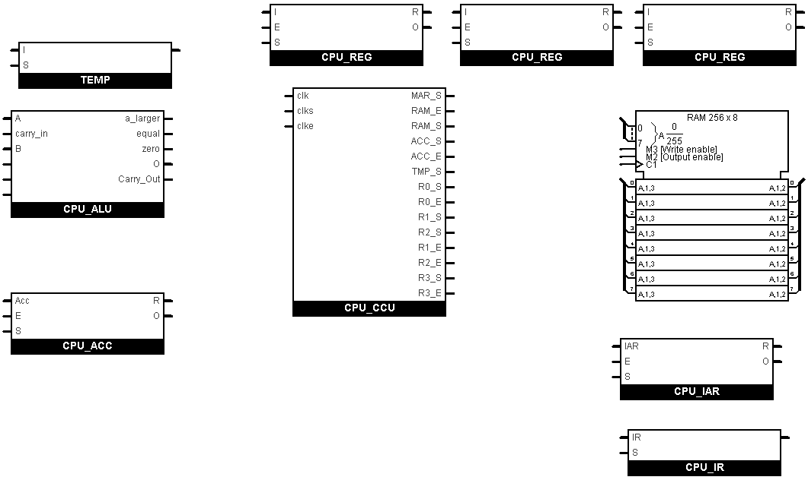
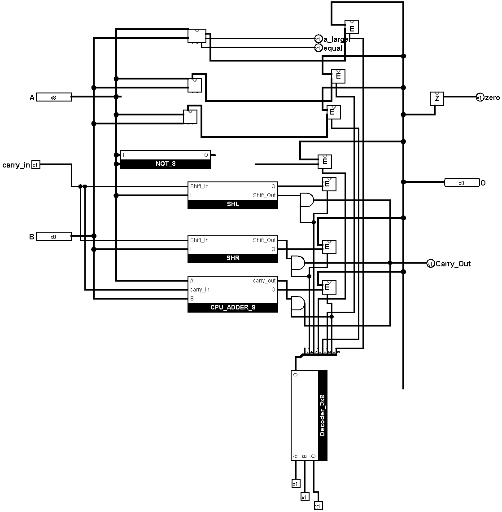
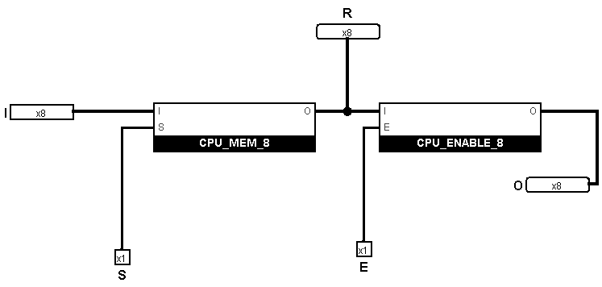
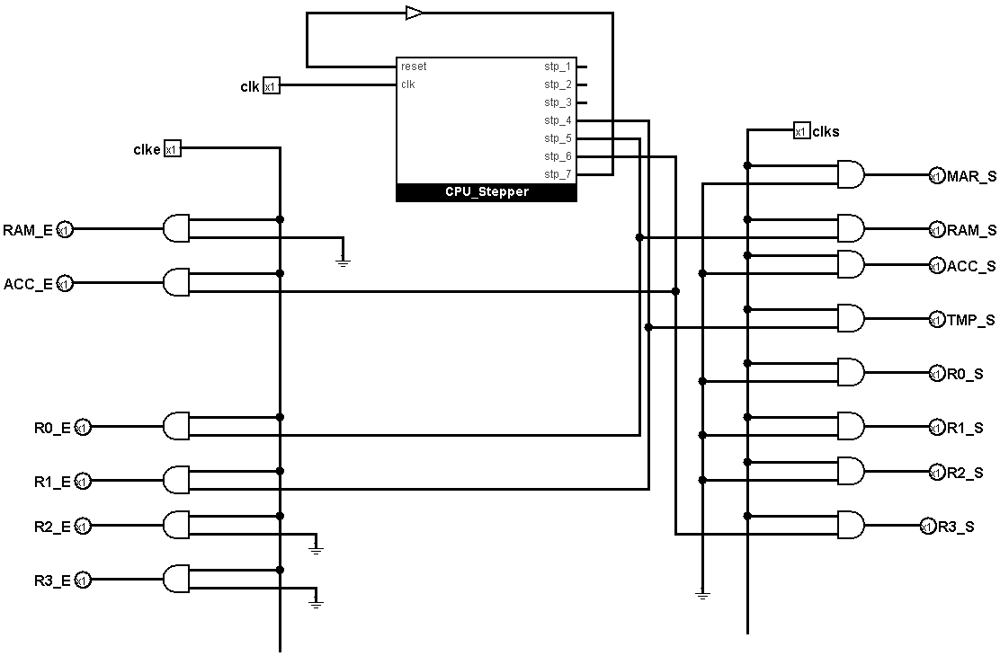
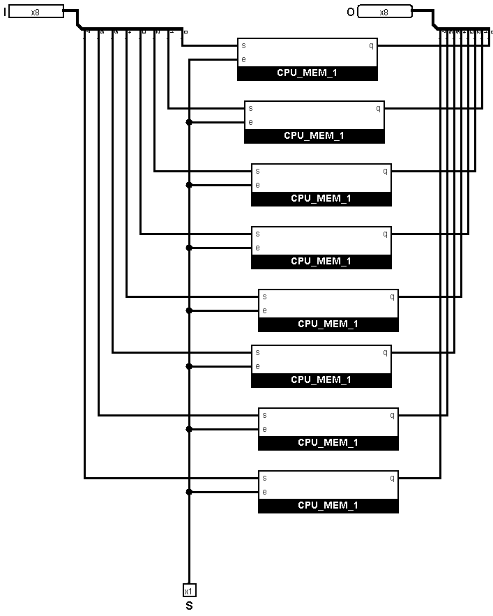

# 🧠 8-Bit CPU Design (Logisim)

A custom-built 8-bit CPU designed using [Logisim](http://www.cburch.com/logisim/). This project demonstrates the basic architecture of a processor, including instruction fetch, decode, and execute stages, with support for a simple instruction set.

---

## 🖼️ Overview



This 8-bit CPU features:

- A **program counter**
- A **control unit**
- A **register file**
- An **ALU (Arithmetic Logic Unit)**
- RAM for instruction and data storage
- Support for branching, arithmetic, and memory instructions

Designed and simulated using **Logisim**, a digital logic simulator.

---

## 🧩 Components

### 🧮 ALU (Arithmetic Logic Unit)



Performs arithmetic (add, subtract) and logic operations (AND, OR, NOT, etc.).

---

### 🗃️ Register File



Includes:
- General-purpose registers (R0–R3)
- Accumulator
- Instruction Register

---

### 📜 Control Unit



The control logic that orchestrates the CPU’s execution cycles, generates control signals, and manages fetch-decode-execute.

---

### 📦 Memory



Includes:
- Instruction Memory
- Data Memory
- Program Counter (PC)

---

## 🚀 Features

✅ 8-bit data bus  
✅ 4-bit opcodes for 16 instructions  
✅ Simple RISC-like architecture  
✅ Manual clock stepping  
✅ Instruction decoding using ROM-based control logic  
✅ Modular and well-documented design

---

## 🛠️ Getting Started

### Requirements

- [Logisim Evolution](https://github.com/reds-heig/logisim-evolution) (recommended)
  - Or [Logisim Classic](http://www.cburch.com/logisim/) if you prefer

### Running the CPU

1. Clone the repository:
   ```bash
   git clone https://github.com/BigB0i11/8bit-CPU-Design.git
   cd 8bit-CPU-Design
